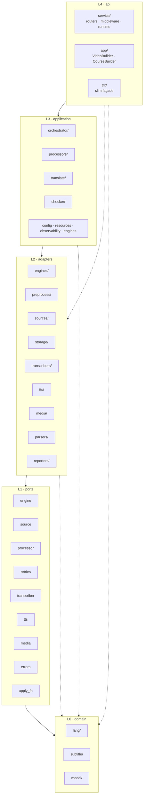

# Layered Architecture

TranslatorX v3 follows **Hexagonal (Ports & Adapters)** with 5 top-level layers
under `src/`. Layers can only depend inward — each may import from itself or
layers to its left. The invariant is enforced at test time by
`tests/test_architecture.py` (148 parametrized cases, one per source file).

```
api  →  application  →  adapters  →  ports  →  domain
```

## ASCII diagram

```
┌─────────────────────────────────────────────────────────────────┐
│  api  (L4 · entrypoints)                                        │
│  ├── service/      FastAPI app, SSE, middleware, runtime        │
│  │   ├── routers/       (admin, health, streams, usage, videos) │
│  │   ├── middleware/    (errors, logging, rate_limit)           │
│  │   ├── runtime/       (tasks, tasks_arq, stream_registry,     │
│  │   │                   error_buffer)                          │
│  │   ├── app.py  auth.py  sse.py  schemas.py  observability.py  │
│  │   └── worker.py  __main__.py                                 │
│  ├── app/          Builder façade (App / VideoBuilder /         │
│  │                 CourseBuilder / StreamBuilder)               │
│  └── trx/          Slim functional façade                       │
└──────────────────────────────┬──────────────────────────────────┘
                               ▼
┌─────────────────────────────────────────────────────────────────┐
│  application  (L3 · orchestration, use cases)                   │
│  ├── orchestrator/   VideoSession (per-video state) + VideoResult │
│  ├── pipeline/       PipelineRuntime + StageRegistry + middleware │
│  ├── stages/         Build / Structure / Enrich stage definitions │
│  ├── processors/     TranslateProcessor / SummaryProcessor /    │
│  │                   AlignProcessor / TtsProcessor / prefix     │
│  ├── translate/      translate_with_verify, providers, prompts  │
│  ├── checker/        Rule-engine: Checker + per-language rules  │
│  ├── engines/        Engine factory (wires ports/engine)        │
│  ├── resources/      InMemoryResourceManager + tiers            │
│  ├── observability/  ProgressEvent / ProgressReporter           │
│  └── config.py       AppConfig (Pydantic v2)                    │
└──────────────────────────────┬──────────────────────────────────┘
                               ▼
┌─────────────────────────────────────────────────────────────────┐
│  adapters  (L2 · concrete external implementations)             │
│  ├── engines/        OpenAICompatEngine                         │
│  ├── media/          YtdlpSource, ffmpeg probe/extract          │
│  ├── parsers/        parse_srt, parse_whisperx, sanitize_*      │
│  ├── preprocess/     PuncRestorer registry (ner/llm/remote),    │
│  │                   Chunker (rule/spacy/llm/composite backends) │
│  ├── reporters/      LoggerReporter, JsonlErrorReporter         │
│  ├── sources/        SrtSource, WhisperXSource, PushQueueSource │
│  ├── storage/        JsonFileStore, Workspace                   │
│  ├── transcribers/   WhisperX local, OpenAI API, HTTP remote    │
│  └── tts/            edge-tts, openai-tts (+ registry skeleton) │
└──────────────────────────────┬──────────────────────────────────┘
                               ▼
┌─────────────────────────────────────────────────────────────────┐
│  ports  (L1 · abstract protocols + generic utilities)           │
│  apply_fn · engine · errors · media · processor · retries ·    │
│  source · transcriber · tts                                     │
└──────────────────────────────┬──────────────────────────────────┘
                               ▼
┌─────────────────────────────────────────────────────────────────┐
│  domain  (L0 · pure domain, no I/O)                             │
│  ├── lang/       LangOps + TextPipeline + per-language tokens   │
│  │               (en, zh, ja, ko, de, fr, es, pt, ru, vi)       │
│  ├── subtitle/   Subtitle + word-timing alignment               │
│  └── model/      Word, Segment, SentenceRecord, Usage           │
└─────────────────────────────────────────────────────────────────┘
```

## Mermaid diagram



## Dependency rule

* **L0 `domain`** — pure. No I/O. Zero outbound dependencies.
* **L1 `ports`** — Protocols + generic helpers. Depends only on `domain`.
* **L2 `adapters`** — concrete integrations (yt-dlp, ffmpeg, OpenAI, spaCy, …).
  Depends on `ports` and `domain`.
* **L3 `application`** — orchestration / business logic. Depends on `adapters`,
  `ports`, `domain`.
* **L4 `api`** — entrypoints (FastAPI service, Builder façade, `trx` façade).
  Depends on everything below.

Imports inside `if TYPE_CHECKING:` blocks are exempt because they do not
execute at runtime.

## Heaviest cross-layer edges (informational)

| From                          | To                            | Count |
| ----------------------------- | ----------------------------- | ----: |
| `api/app`                     | `application/processors`      |     9 |
| `api/service`                 | `application/resources`       |     7 |
| `application/translate`       | `ports/engine`                |     6 |
| `adapters/tts`                | `ports/tts`                   |     6 |
| `adapters/transcribers`       | `ports/transcriber`           |     5 |
| `api/app`                     | `adapters/preprocess`         |     5 |
| `adapters/preprocess`         | `ports/retries`               |     3 |

Each `adapters/<kind>` cleanly pairs with a `ports/<kind>` Protocol — that is
the hex-arch pattern working as intended.

## Enforcement

* `tests/test_architecture.py` walks every file under `src/`, parses imports
  with `ast`, skips `TYPE_CHECKING` blocks, and fails if any upward reference
  is detected.
* Run locally: `pytest tests/test_architecture.py -q`.
